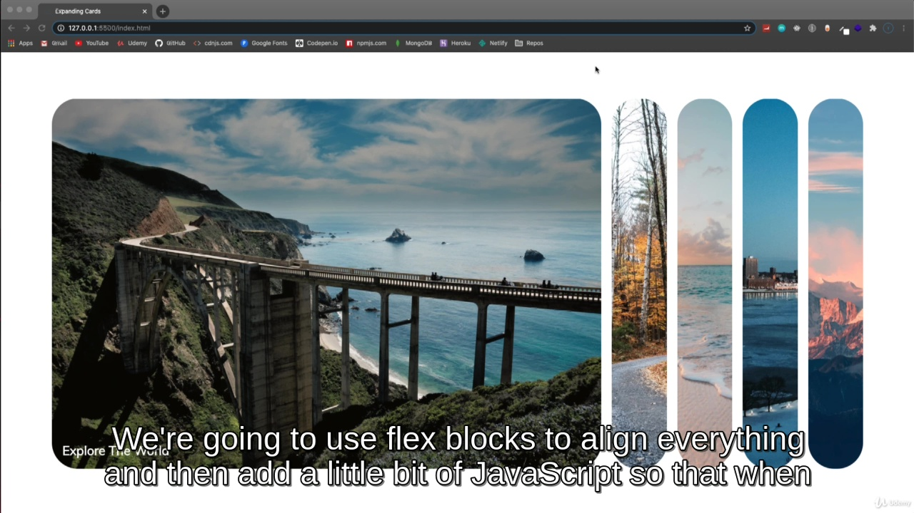
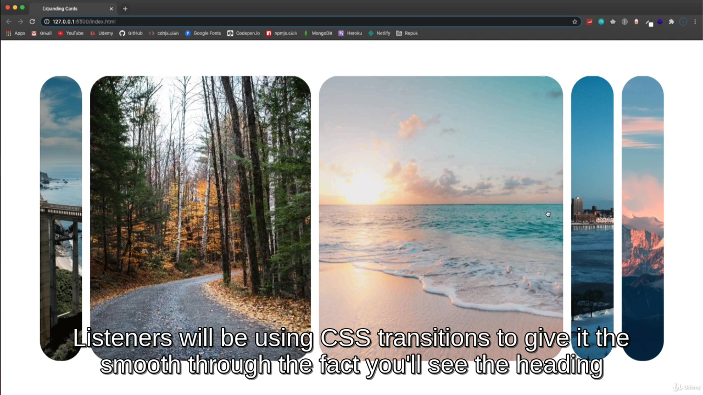
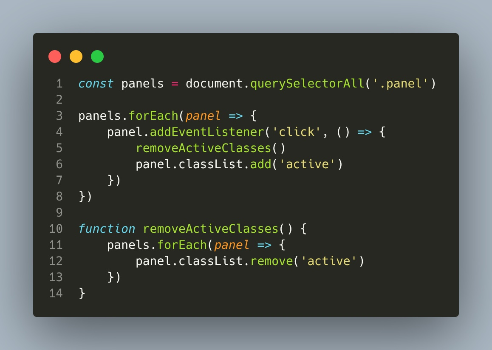

Dia 01 - Expanding Cards

## Vídeo 01 - Project Intro

<video width="60%" controls>
  <source src="000-Midia_e_Anexos/005 Project Intro.mp4" type="video/mp4">
    Seu navegador não suporta vídeo HTML5.
</video>

### Anotações

#### Projeto Expanding Cards

<p align="center">

</p>

Neste projeto, o objetivo é desenvolver uma interface de cartões expansíveis ("Expanding Cards"). O layout inicial apresenta painéis verticais lado a lado, onde cada um contém uma imagem de fundo e um título específico. A estrutura utiliza blocos flexíveis (Flexbox) para o alinhamento dos elementos na tela.

<p align="center">

</p>

A funcionalidade principal será controlada por JavaScript para gerenciar os cliques nos painéis. Ao selecionar uma imagem, uma classe "active" é aplicada ao elemento, disparando uma transição suave de CSS que expande o cartão. Um detalhe importante da interface é que o título do painel só aparece após o cartão estar totalmente expandido, garantindo um efeito visual limpo e fluido.

<p align="center">

</p>

A estrutura básica do projeto é definida no arquivo HTML, estabelecendo o esqueleto dos cartões dentro de um contêiner principal. Cada painel é representado por uma `div` com a classe `panel`, onde as imagens de fundo são inseridas via estilos inline diretamente do Unsplash.

```html
<!DOCTYPE html>
<html lang="en">
<head>
    <meta charset="UTF-8" />
    <meta name="viewport" content="width=device-width, initial-scale=1.0" />
    <link rel="stylesheet" href="style.css" />
    <title>Expanding Cards</title>
</head>
<body>
    <div class="container">
        <div class="panel active" style="background-image: url('https://images.unsplash.com/photo-1558981806-ec527fa84c39?ixlib=rb-1.2.1&ixid=eyJhcHBfaWQiOjEyMDd9&auto=format&fit=crop&w=1350&q=80')">
            <h3>Explore The World</h3>
        </div>
        <div class="panel" style="background-image: url('https://images.unsplash.com/photo-1572276596237-5db2c3e16c5d?ixlib=rb-1.2.1&ixid=eyJhcHBfaWQiOjEyMDd9&auto=format&fit=crop&w=1350&q=80')">
            <h3>Wild Forest</h3>
        </div>
        <div class="panel" style="background-image: url('https://images.unsplash.com/photo-1507525428034-b723cf961d3e?ixlib=rb-1.2.1&ixid=eyJhcHBfaWQiOjEyMDd9&auto=format&fit=crop&w=1353&q=80')">
            <h3>Sunny Beach</h3>
        </div>
        <div class="panel" style="background-image: url('https://images.unsplash.com/photo-1551009175-8a68da93d5f9?ixlib=rb-1.2.1&ixid=eyJhcHBfaWQiOjEyMDd9&auto=format&fit=crop&w=1351&q=80')">
            <h3>City on Winter</h3>
        </div>
        <div class="panel" style="background-image: url('https://images.unsplash.com/photo-1549880338-65ddcdfd017b?ixlib=rb-1.2.1&ixid=eyJhcHBfaWQiOjEyMDd9&auto=format&fit=crop&w=1350&q=80')">
            <h3>Mountains Clouds</h3>
        </div>
    </div>
    <script src="script.js"></script>
</body>
</html>

```

<p align="center">

</p>

A estilização CSS define o comportamento visual e as animações. O uso de `display: flex` no contêiner permite que os painéis se distribuam horizontalmente. Cada painel possui uma propriedade `flex` inicial de 0.5, que aumenta para 5 quando a classe `.active` é aplicada, criando o efeito de expansão. As transições são configuradas para garantir que o movimento seja suave.

```css
@import url('https://fonts.googleapis.com/css?family=Muli&display=swap');

* {
  box-sizing: border-box;
}

body {
  font-family: 'Muli', sans-serif;
  display: flex;
  align-items: center;
  justify-content: center;
  height: 100vh;
  overflow: hidden;
  margin: 0;
}

.container {
  display: flex;
  width: 90vw;
}

.panel {
  background-size: cover;
  background-position: center;
  background-repeat: no-repeat;
  height: 80vh;
  border-radius: 50px;
  color: #fff;
  cursor: pointer;
  flex: 0.5;
  margin: 10px;
  position: relative;
  -webkit-transition: all 700ms ease-in;
}

.panel h3 {
  font-size: 24px;
  position: absolute;
  bottom: 20px;
  left: 20px;
  margin: 0;
  opacity: 0;
}

.panel.active {
  flex: 5;
}

.panel.active h3 {
  opacity: 1;
  transition: opacity 0.3s ease-in 0.4s;
}

@media (max-width: 480px) {
  .container {
    width: 100vw;
  }

  .panel:nth-of-type(4),
  .panel:nth-of-type(5) {
    display: none;
  }
}

```

<p align="center">

</p>

O script JavaScript é responsável pela interatividade. Ele seleciona todos os elementos com a classe `.panel` e adiciona um `event listner`de clique para cada um. Quando um painel é clicado, a função `removeActiveClasses` é chamada para garantir que apenas um cartão esteja expandido por vez, removendo a classe `active` de todos os outros antes de adicioná-la ao painel selecionado.

```javascript
const panels = document.querySelectorAll('.panel')

panels.forEach(panel => {
    panel.addEventListener('click', () => {
        removeActiveClasses()
        panel.classList.add('active')
    })
})

function removeActiveClasses() {
    panels.forEach(panel => {
        panel.classList.remove('active')
    })
}

```
