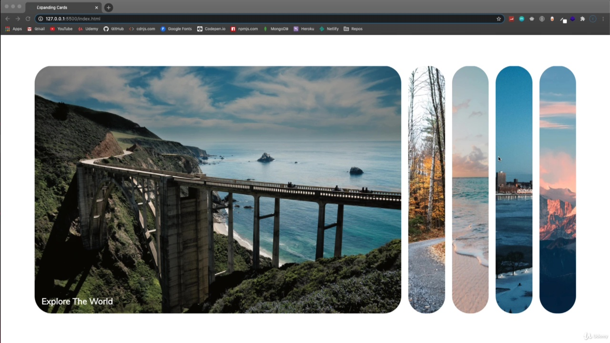
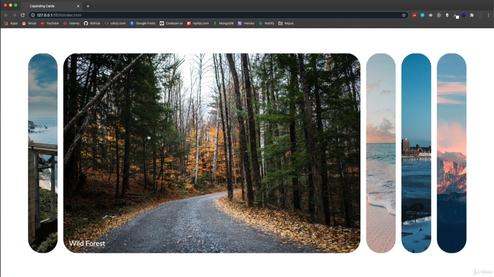
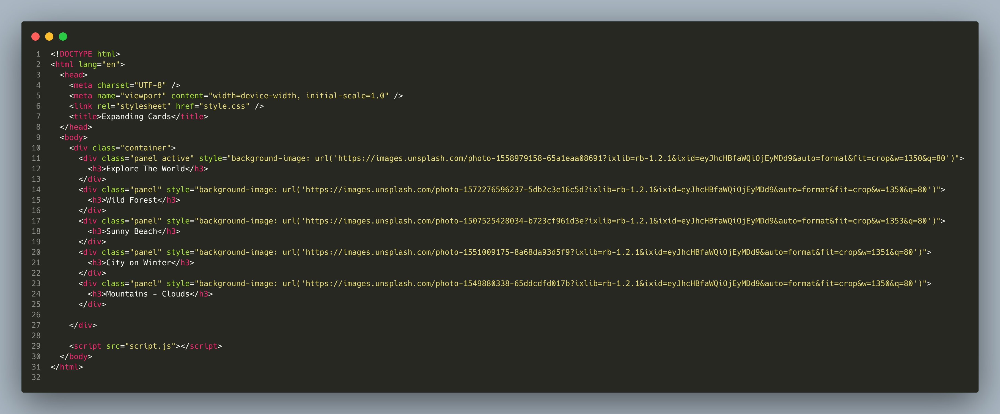
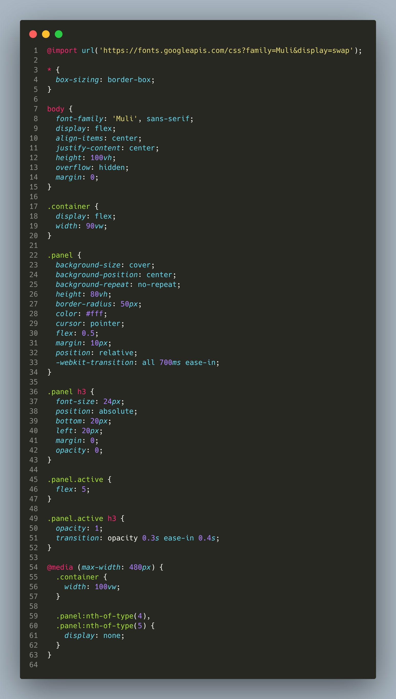

Dia 01 - Expanding Cards

## Vídeo 01 - Project Intro

<video width="60%" controls>
  <source src="000-Midia_e_Anexos/005.Project.Intro.mp4" type="video/mp4">
    Seu navegador não suporta vídeo HTML5.
</video>

### Anotações

#### Projeto Expanding Cards

<p align="center">

</p>

Neste projeto, o objetivo é desenvolver **Expanding Cards** (cartões expansíveis). A interface inicial apresenta uma série de painéis verticais onde o primeiro cartão, com o título "Explore The World", aparece expandido, destacando-se dos demais que permanecem em um estado retraído. O layout utiliza **Flexbox** para o alinhamento dos componentes, garantindo que as imagens de fundo e os títulos sejam distribuídos de forma harmoniosa.

<p align="center">

</p>

A funcionalidade principal do projeto baseia-se na interação do usuário: ao clicar em um painel diferente, como o "Wild Forest", o estado do cartão é alterado. Através do **JavaScript**, adicionamos ouvintes de evento (*event listeners*) que alternam a classe CSS para `active`. Essa mudança dispara uma **transição CSS**, resultando em um efeito de expansão suave. Um detalhe importante da implementação é que o título do cartão só se torna visível após a conclusão da expansão total do painel.

## Vídeo 02 - Initial Cards

<video width="60%" controls>
  <source src="000-Midia_e_Anexos/006.Initial.Cards.mp4" type="video/mp4">
    Seu navegador não suporta vídeo HTML5.
</video>

### Anotações

<p align="center">

</p>

Nesta etapa inicial, definimos a estrutura fundamental do projeto utilizando HTML5. O objetivo é criar um componente de cartões expansíveis, onde um contêiner principal abriga cinco divisões com a classe `panel`. A primeira dessas divisões recebe adicionalmente a classe `active`, que servirá para identificar visualmente qual cartão deve aparecer expandido por padrão.

Cada painel utiliza estilos inline para definir sua imagem de fundo, permitindo que cada cartão exiba uma paisagem distinta, como florestas, praias ou montanhas. O conteúdo interno de cada painel é composto por um título `<h3>` que descreve a imagem correspondente.

▶️ Código HTML (index.html)

```html
<!DOCTYPE html>
<html lang="en">
<head>
    <meta charset="UTF-8" />
    <meta name="viewport" content="width=device-width, initial-scale=1.0" />
    <link rel="stylesheet" href="style.css" />
    <title>Expanding Cards</title>
</head>
<body>
    <div class="container">
        <div class="panel active" style="background-image: url('https://images.unsplash.com/photo-1558981806-ec527fa84c39?ixlib=rb-1.2.1&ixid=eyJhcHBfaWQi0jEyMDd9&auto=format&fit=crop&w=1350&q=80')">
            <h3>Explore The World</h3>
        </div>
        <div class="panel" style="background-image: url('https://images.unsplash.com/photo-1572276596237-5db2c3e16c5d?ixlib=rb-1.2.1&ixid=eyJhcHBfaWQi0jEyMDd9&auto=format&fit=crop&w=1350&q=80')">
            <h3>Wild Forest</h3>
        </div>
        <div class="panel" style="background-image: url('https://images.unsplash.com/photo-1507525428034-b723cf961d3e?ixlib=rb-1.2.1&ixid=eyJhcHBfaWQi0jEyMDd9&auto=format&fit=crop&w=1353&q=80')">
            <h3>Sunny Beach</h3>
        </div>
        <div class="panel" style="background-image: url('https://images.unsplash.com/photo-1551009175-8a68da93d5f9?ixlib=rb-1.2.1&ixid=eyJhcHBfaWQi0jEyMDd9&auto=format&fit=crop&w=1351&q=80')">
            <h3>City on Winter</h3>
        </div>
        <div class="panel" style="background-image: url('https://images.unsplash.com/photo-1549880338-65ddcdfd017b?ixlib=rb-1.2.1&ixid=eyJhcHBfaWQi0jEyMDd9&auto=format&fit=crop&w=1350&q=80')">
            <h3>Mountains Clouds</h3>
        </div>
    </div>
    <script src="script.js"></script>
</body>
</html>

```

<p align="center">

</p>

A estilização com CSS transforma a lista estática de divs em um layout flexível e interativo. O uso de `display: flex` no contêiner alinha os painéis horizontalmente. Cada painel possui propriedades de fundo configuradas para cobrir a área total e cantos arredondados com `border-radius: 50px`.

A interatividade visual é controlada pela propriedade `flex`. Enquanto os painéis padrão possuem `flex: 0.5`, o painel que recebe a classe `.active` expande para `flex: 5`, criando o efeito de destaque. Para suavizar essa transição, aplica-se uma `transition` de 700ms. Além disso, os títulos `<h3>` permanecem ocultos (`opacity: 0`) e tornam-se visíveis apenas no painel ativo através de uma transição de opacidade. O código também inclui uma media query para garantir a responsividade em dispositivos móveis, ocultando os dois últimos painéis em telas com largura inferior a 480px.

▶️ Código CSS (style.css)

```css
@import url('https://fonts.googleapis.com/css?family=Muli&display=swap');

* {
  box-sizing: border-box;
}

body {
  font-family: 'Muli', sans-serif;
  display: flex;
  align-items: center;
  justify-content: center;
  height: 100vh;
  overflow: hidden;
  margin: 0;
}

.container {
  display: flex;
  width: 90vw;
}

.panel {
  background-size: cover;
  background-position: center;
  background-repeat: no-repeat;
  height: 80vh;
  border-radius: 50px;
  color: #fff;
  cursor: pointer;
  flex: 0.5;
  margin: 10px;
  position: relative;
  -webkit-transition: all 700ms ease-in;
}

.panel h3 {
  font-size: 24px;
  position: absolute;
  bottom: 20px;
  left: 20px;
  margin: 0;
  opacity: 0;
}

.panel.active {
  flex: 5;
}

.panel.active h3 {
  opacity: 1;
  transition: opacity 0.3s ease-in 0.4s;
}

@media (max-width: 480px) {
  .container {
    width: 100vw;
  }

  .panel:nth-of-type(4),
  .panel:nth-of-type(5) {
    display: none;
  }
}

```

<details>
<summary> EXPLICAÇÃO DETALHADA (clicar para expandir)🔻</summary>

```css
@import url('https://fonts.googleapis.com/css?family=Muli&display=swap');
```
- Importa a fonte **Muli** do Google Fonts para ser usada no site.

---

```css
* {
  box-sizing: border-box;
}
```
- Aplica a todos os elementos (`*`) o modelo de caixa **border-box**, que inclui bordas e padding dentro da largura/altura total do elemento. Isso facilita o controle de layout.

---

```css
body {
  font-family: 'Muli', sans-serif;
  display: flex;
  align-items: center;
  justify-content: center;
  height: 100vh;
  overflow: hidden;
  margin: 0;
}
```
- Define a fonte principal como **Muli** (ou sans-serif se não disponível).  
- Usa **flexbox** para centralizar o conteúdo tanto vertical quanto horizontalmente.  
- `height: 100vh` → ocupa toda a altura da janela do navegador.  
- `overflow: hidden` → esconde qualquer conteúdo que ultrapasse os limites da tela.  
- `margin: 0` → remove margens padrão do navegador.

---

```css
.container {
  display: flex;
  width: 90vw;
}
```
- Define o container como **flexbox**.  
- `width: 90vw` → largura de 90% da largura da janela (viewport).

---

```css
.panel {
  background-size: cover;
  background-position: center;
  background-repeat: no-repeat;
  height: 80vh;
  border-radius: 50px;
  color: #fff;
  cursor: pointer;
  flex: 0.5;
  margin: 10px;
  position: relative;
  -webkit-transition: all 700ms ease-in;
}
```
- Configura os painéis (provavelmente imagens de fundo):  
  - `background-size: cover` → imagem cobre todo o painel.  
  - `background-position: center` → centraliza a imagem.  
  - `background-repeat: no-repeat` → evita repetição da imagem.  
- `height: 80vh` → altura de 80% da janela.  
- `border-radius: 50px` → cantos arredondados.  
- `color: #fff` → texto branco.  
- `cursor: pointer` → cursor vira mãozinha ao passar por cima.  
- `flex: 0.5` → ocupa metade da proporção de espaço no flex container.  
- `margin: 10px` → espaçamento externo.  
- `position: relative` → permite posicionar elementos filhos de forma absoluta.  
- `transition` → anima mudanças de estilo suavemente em 700ms.

---

```css
.panel h3 {
  font-size: 24px;
  position: absolute;
  bottom: 20px;
  left: 20px;
  margin: 0;
  opacity: 0;
}
```
- Estiliza o título dentro do painel:  
  - Fonte de 24px.  
  - Posicionado no canto inferior esquerdo.  
  - Sem margem extra.  
  - `opacity: 0` → invisível inicialmente.

---

```css
.panel.active {
  flex: 5;
}
```
- Quando o painel recebe a classe **active**, ele expande ocupando mais espaço (5 vezes a proporção normal).

---

```css
.panel.active h3 {
  opacity: 1;
  transition: opacity 0.3s ease-in 0.4s;
}
```
- O título dentro do painel ativo aparece (`opacity: 1`).  
- A transição da opacidade dura 0.3s, com atraso de 0.4s para dar efeito suave.

---

```css
@media (max-width: 480px) {
  .container {
    width: 100vw;
  }

  .panel:nth-of-type(4),
  .panel:nth-of-type(5) {
    display: none;
  }
}
```
- **Media query**: aplica estilos apenas em telas menores que 480px (celulares).  
- `width: 100vw` → container ocupa toda a largura da tela.  
- Esconde os painéis 4 e 5 para simplificar o layout em telas pequenas.
</details>


## Vídeo 03 - Expanding Effect

<video width="60%" controls>
  <source src="000-Midia_e_Anexos/007.Expanding.Effect.mp4" type="video/mp4">
    Seu navegador não suporta vídeo HTML5.
</video>

### Anotações

<p align="center">

</p>

Nesta etapa, o foco é a manipulação do DOM para criar a interatividade da galeria. O objetivo inicial é selecionar todos os elementos que representam os painéis e adicionar um *event listener* para identificar o clique do usuário. Ao clicar em um painel, a classe `active` deve ser gerenciada para que o elemento se expanda, enquanto os outros retornam ao estado original.

Para capturar múltiplos elementos simultaneamente, utilizamos o método `querySelectorAll`, que agrupa os itens em uma `nodeList`. A partir daí, percorremos essa lista com um `forEach` para aplicar a lógica de clique e a alternância de classes.

```javascript
const panels = document.querySelectorAll('.panel')

panels.forEach(panel => {
  panel.addEventListener('click', () => {
    removeActiveClasses()
    panel.classList.add('active')
  })
})

function removeActiveClasses() {
  panels.forEach(panel => {
    panel.classList.remove('active')
  })
}

```

A lógica funcional segue estes passos:

1. **Seleção**: Todos os elementos com a classe `.panel` são armazenados na constante `panels`.
2. **Iteração e Evento**: O loop `forEach` adiciona um `addEventListener` de clique a cada painel individual.
3. **Limpeza**: A função `removeActiveClasses` é chamada imediatamente após o clique para garantir que nenhum outro painel possua a classe `active` antes de destacar o novo.
4. **Ativação**: O método `classList.add('active')` é aplicado ao painel clicado, disparando as transições de CSS para a expansão visual.


